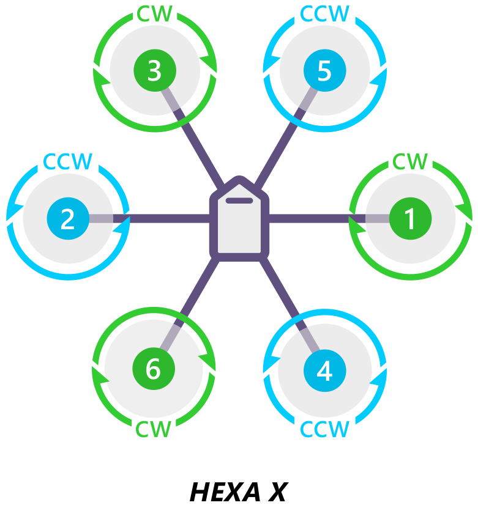
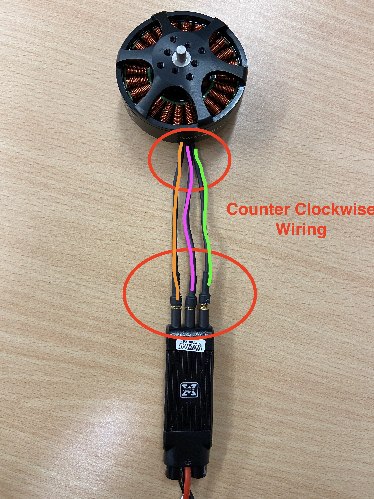

# Rotorbooms
{: .no_toc }
The rotorbooms are how the motors are connected to the central hub. This assembly incorporates the Motors, their mounts, the rotorbooms and the ESCs.

## Table of Content:
{: .no_toc .text-delta }

1. TOC
{:toc}

## Requirements: 

### Parts:

| Component              | Hex Quantity | Quad Quantity | Description                          |
|:------------------------|:--------------|:---------------|:--------------------------------------|
| [Motor Mount](https://github.com/landrs-toolkit/LANDRs-Science-Drone/blob/main/Design/MechanicalDesign/MotorMounts) | 6 | 4 | Printed motor mount |
| Carbon Rotorboom | 6| 4 | 25x23x500mm length of carbon tube    |
| [T-Motor MN5008](https://store.tmotor.com/goods.php?id=999) | 6 | 4 | 6S 340KV electric motor |
| [Xrotor Pro 40A ESC](https://www.hobbywing.com/goods.php?id=400&filter_attr=15045) | 6 | 4 | 40A Electric speed controllers |
| M3 30mm bolt | 36 | 24 | M3 socket head 30mm bolt|
| M3 standard Nut | 12| 8 | M3 standard nut for 3D prints|

## Assembling the Rotorbooms:

The following illustrations will assist with assembling the rotorbooms of the HexaQuad. Repeat the following steps 6 times for Hex or 4 times in the case of the Quad configuration.

### Step 1: *Attaching the motors to the mounts*

Fit the motor onto the printed mount, aligning the mounting holes. Use **4 x M3x10mm** hex socket bolts to secure the motor to the mount. 

When aligning the motor on the mount, ensure the motor power cables are on the same side as the "Wire guide notch" of the motor mount.

### Step 2: *Fitting the ESC inside the carbon rotorboom*

With the motor mounted, now guide the motor power wires through the opening as shown below.

There after, the ESC can be connected to the wires via the bullet connectors. Be sure to confirm the wire connection order for the two rotation directions.

Once satisfied the connection direction is correct, the ESC connected to the motor can now be slipped into the carbon fiber rotorboom.

**NOTE: It is recommended to put hot glue around the bullet connections to ensure they do not come loose!**

Push the ESC into the tube. Gently pull on the ESC power wires whilst sliding the tube in the opposite direction until the ESC is inside the rotorboom and the end of the rotorboom is flush with the stopper end of the motor mount.

With either a pencil or marker and tape, label the motor direction on the rotorboom for ease of identification.

### Step 3: *Securing the rotorboom to the motor mount*

Finally, using **2 x M3x10mm** hex socket bolts and **2 x M3** standard nuts, secure the rotorboom to the motor mount.

## Labeling the Rotorbooms:
It is recommend to label the rotorbooms by motor number, this makes assembly easier as the flight controller expects certain motors to be in certain locations as shown below:

|Hexacopter Motors|Quadcopter Motors|
|:----|:----|
|||

With a marker, write the number of the motor on the ESC signal lead as follows

## Clockwise or Counter Clockwise ESCs:

There are two directions the motors can turn, clockwise (CW) and counter clockwise (CCW). This requires slightly different connections between the motor and ESC. In both configurations, half of the motors will be CW and the other half will be CCW.

|Configuration| CW Motors|CCW Motors|
|:--|:--|:--|
|Hex|3|3|
|Quad|2|2|

**To ensure the correct result from this guide please use exactly the same orientations of motor and ESC!**

|Clockwise|Counter Clockwise|
|:----|:----|
|||

[Previous Section](../../GettingStarted/BuildInstructions/LandingGear.md){: .btn} [Next Section](../../GettingStarted/BuildInstructions/TopPlate.md){: .btn .float-right}
