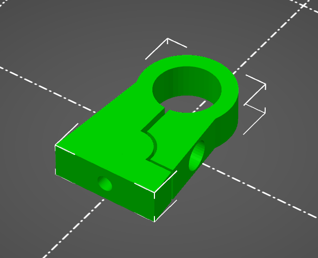
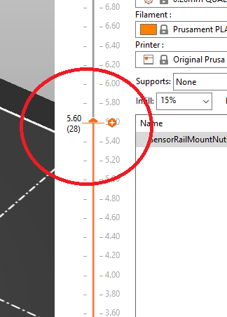
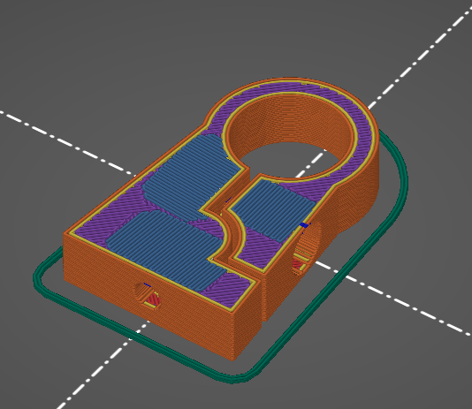

# Adding Inserts to 3D Prints:
{: .no_toc }
3D printing is a great technique for creating complex parts in a short time, however they generally lack mechanical properties like strength or durability. Inserts give prints improved mechanical performance by embedding components like threaded nuts or bearings.

## Table of Content:
{: .no_toc .text-delta }

1. TOC
{:toc}

# Designing 3D Prints with Inserts:
Designing prints with inserts is a simple task if some basic rules are followed. This section outlines some rules to keep in mind.

## Sizing the Cavity:
When designing a 3D print with an insert there must be a cavity to house the insert. It is recommended to over size the cavity by 0.2mm to account for the printer inaccuracy and for ease of insertion.

## Cavity Shape:
The shape of the cavity will depend on the print orientation. The cavity will either be the same shape as the component or slightly altered. We need to consider the orientation because the cavity will be printed from bottom to top. Below is an example of a cavity with an altered cavity.

Generally a cavity will have a top and bottom, especially if it is an *altered* cavity. When altering a cavity it is vital to ensure the top opening is the same width as the widest part of the component, otherwise it will be impossible to insert the component.

## Rules to Keep in Mind:
- Know the print orientation **before** creating a cavity.
- The cavity prints from **bottom to top**.
- Ensure the top opening is as **wide as the widest part** of the component.

# How to Embed a Nut in a 3D Print:
The following steps are for a PrusaMini, however there are concepts that can be transferred to other printers.

## Step 1, Correct Orientation of the Print:
The cavity for the insert generally has a bottom and a top. The part must be orientated such that the bottom of the cavity is printed first. If the cavity is printed in reverse, you **will not** be able to insert the nut.

 

## Step 2, Slicing and Adding a Pause: (Prusa Specific)
Prusa already have great documentation on this and it can be found [here](https://help.prusa3d.com/article/insert-pause-or-custom-g-code-at-layer_120490).

However, simply put if you slide the orange layer slider on the right of the screen a "+" appears. Clicking this gives you the option to add a `Pause`, `Colour Change` or `Custom G-code` at the **current** layer. Select a `Pause`. Note, you can only add a pause if the print has been sliced.

## Step3, Choosing the Correct Layer for a Pause
We only want to insert the nut into the cavity just before the cavity closes. If we insert the nut before this point it will leave a portion of the nut protruding from the cavity and can collide with the extruder. The idea then, is to determine at which layer the cavity closes.

There are two layers you must find to add a successful pause. The Layer that the **cavity closes** and the layer **before** the cavity closes.

**Layer Before Cavity Closes**

**Layer When Cavity Closes**

We want to add the pause on the layer **BEFORE** the cavity closes. Add the pause as described in **Step 2**.
You can then slice the print and export the G-code for printing.

Happy Printing!
